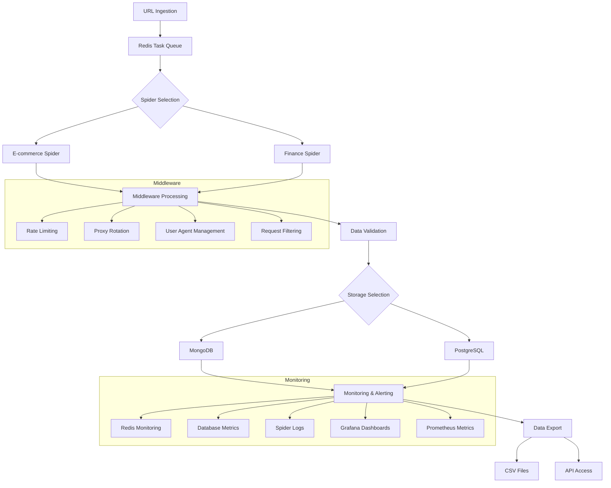

# Application Workflow

## Workflow Description

1. **URL Ingestion**: URLs are added to the Redis task queue through the Redis client interface
2. **Spider Selection**: The system selects the appropriate spider based on the URL domain and type
3. **Middleware Processing**: Each request goes through multiple middleware components for:
   - Rate limiting
   - Proxy rotation
   - User agent management
   - Request filtering
4. **Data Validation**: Extracted data is validated against predefined schemas
5. **Storage**: Validated data is stored in either MongoDB or PostgreSQL
6. **Monitoring**: System performance and data quality are monitored through various tools
7. **Export**: Data can be exported as CSV files or accessed through an API